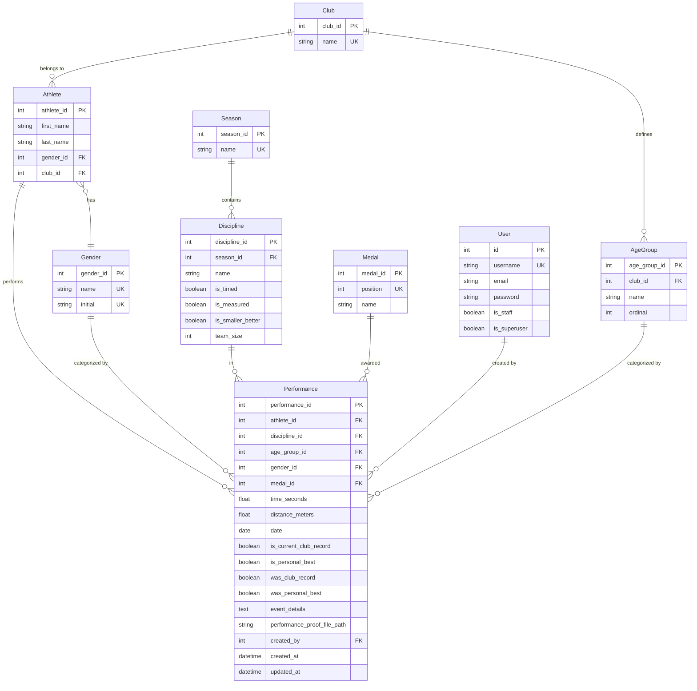

# Data Models & Database Schema

## Overview

The TrackRecord system uses a relational database model designed to support athletics club management with comprehensive performance tracking. The schema is optimized for multi-club operations while maintaining data integrity and performance.

## Core Entities

### Club

The central entity representing an athletics club.

**Fields:**

- `club_id` (AutoField, Primary Key): Unique identifier
- `name` (CharField, max_length=256, unique): Club name

**Business Rules:**

- Club names must be unique across the system
- Each club maintains independent records and athlete lists
- Clubs cannot be deleted if they have associated athletes

### Athlete

Represents individual athletes within a club.

**Fields:**

- `athlete_id` (AutoField, Primary Key): Unique identifier
- `first_name` (CharField, max_length=64): Athlete's first name
- `last_name` (CharField, max_length=64): Athlete's last name
- `gender` (ForeignKey to Gender): Athlete's gender
- `club` (ForeignKey to Club): Associated club

**Business Rules:**

- Unique constraint on (club, first_name, last_name)
- Athletes belong to exactly one club
- Athlete names are case-sensitive for display but case-insensitive for uniqueness

### Gender

Defines gender categories for athletes and competitions.

**Fields:**

- `gender_id` (AutoField, Primary Key): Unique identifier
- `name` (CharField, max_length=8, unique): Full name (e.g., "Male", "Female")
- `initial` (CharField, max_length=1, unique): Single character (e.g., "M", "F")

**Business Rules:**

- Gender names and initials must be unique
- Standard genders are Male (M) and Female (F)
- Mixed gender events use null gender reference

### Season

Represents competition seasons or periods.

**Fields:**

- `season_id` (AutoField, Primary Key): Unique identifier
- `name` (CharField, max_length=32, unique): Season name (e.g., "Track & Field", "Indoors")

**Business Rules:**

- Season names must be unique
- Seasons are global across all clubs
- Common seasons include "Track & Field" and "Indoors"

### AgeGroup

Defines age categories for competition and record keeping.

**Fields:**

- `age_group_id` (AutoField, Primary Key): Unique identifier
- `club` (ForeignKey to Club): Associated club
- `name` (CharField, max_length=256): Age group name (e.g., "U9", "U10", "Senior")
- `ordinal` (IntegerField): Ordering value for display

**Business Rules:**

- Unique constraint on (club, name)
- Age groups are club-specific configurations
- Ordinal values determine display order
- Standard age groups: U9, U10, U11, U12, U13, U14, U15, U16, U17, U18, U19, U20, Senior, Masters

### Discipline

Represents athletic events or disciplines.

**Fields:**

- `discipline_id` (AutoField, Primary Key): Unique identifier
- `season` (ForeignKey to Season): Associated season
- `name` (CharField, max_length=64): Discipline name (e.g., "100m", "High Jump")
- `is_timed` (BooleanField): True for time-based events
- `is_measured` (BooleanField): True for distance/height-based events
- `is_smaller_better` (BooleanField): True if lower values are better (e.g., timed events)
- `team_size` (IntegerField, nullable): Number of team members (null for individual events)

**Business Rules:**

- Unique constraint on (season, name)
- Must be either timed OR measured, not both
- Team size must be >= 1 if specified
- Same discipline in different seasons are separate entities
- Examples: 100m (timed, smaller_better), High Jump (measured, larger_better)

### Medal

Defines competition placement positions and their corresponding medals.

**Fields:**

- `medal_id` (AutoField, Primary Key): Unique identifier
- `position` (IntegerField, unique): Competition position (1-12)
- `name` (CharField, max_length=32): Medal name (e.g., "Gold", "Silver", "Bronze")

**Business Rules:**

- Position numbers must be unique
- Standard medals: 1st-Gold, 2nd-Silver, 3rd-Bronze, 4th-12th-Bronze
- Supports cross-country style extended bronze medals

### Performance

The central entity tracking athlete performances and achievements.

**Fields:**

- `performance_id` (AutoField, Primary Key): Unique identifier
- `athlete` (ForeignKey to Athlete): Performing athlete
- `discipline` (ForeignKey to Discipline): Event discipline
- `age_group` (ForeignKey to AgeGroup): Age category
- `gender` (ForeignKey to Gender, nullable): Gender category (null for mixed events)
- `medal` (ForeignKey to Medal, nullable): Competition placement
- `time_seconds` (FloatField, nullable): Time result in seconds
- `distance_meters` (FloatField, nullable): Distance result in meters
- `date` (DateField): Performance date
- `is_current_club_record` (BooleanField): Current club record flag
- `is_personal_best` (BooleanField): Current personal best flag
- `was_club_record` (BooleanField): Historical club record flag
- `was_personal_best` (BooleanField): Historical personal best flag
- `event_details` (TextField): Event description
- `performance_proof_file_path` (ImageField): Proof document/image
- `created_by` (ForeignKey to User): User who created the record
- `created_at` (DateTimeField): Creation timestamp
- `updated_at` (DateTimeField): Last update timestamp

**Business Rules:**

- Unique constraint on (athlete, discipline, age_group, gender, date, event_details)
- Must have either medal OR performance value (or both)
- Time values only for timed disciplines
- Distance values only for measured disciplines
- Team disciplines don't generate personal bests
- Record flags are automatically calculated and cached
- Performance updates are not allowed (delete and recreate instead)

## Entity Relationship Diagram

## Key Relationships

### One-to-Many Relationships

- **Club → Athlete**: Each club has multiple athletes
- **Club → AgeGroup**: Each club defines its own age groups
- **Season → Discipline**: Each season contains multiple disciplines
- **Athlete → Performance**: Each athlete has multiple performances
- **Discipline → Performance**: Each discipline has multiple performances
- **AgeGroup → Performance**: Each age group has multiple performances
- **Gender → Performance**: Each gender has multiple performances
- **Medal → Performance**: Each medal type has multiple performances
- **User → Performance**: Each user creates multiple performances

### Many-to-One Relationships

- **Athlete → Gender**: Each athlete has one gender
- **Performance → Athlete**: Each performance belongs to one athlete
- **Performance → Discipline**: Each performance is in one discipline
- **Performance → AgeGroup**: Each performance is in one age group
- **Performance → Gender**: Each performance has one gender (or null for mixed)
- **Performance → Medal**: Each performance may have one medal
- **Performance → User**: Each performance is created by one user

## Data Integrity Constraints

### Primary Keys

- All entities use auto-incrementing integer primary keys
- Primary keys are named consistently (e.g., `club_id`, `athlete_id`)

### Foreign Key Constraints

- All foreign keys enforce referential integrity
- Cascade deletes are used where appropriate (e.g., Club → Athlete)
- SET_NULL is used for optional relationships (e.g., Performance → Medal)

### Unique Constraints

- **Club**: name must be unique
- **Gender**: name and initial must be unique
- **Season**: name must be unique
- **Medal**: position must be unique
- **AgeGroup**: (club, name) must be unique
- **Discipline**: (season, name) must be unique
- **Athlete**: (club, first_name, last_name) must be unique
- **Performance**: (athlete, discipline, age_group, gender, date, event_details) must be unique

### Check Constraints

- **Discipline**: Must be either timed OR measured, not both
- **Discipline**: team_size must be >= 1 if specified
- **Performance**: Must have either medal OR performance value
- **Performance**: time_seconds only for timed disciplines
- **Performance**: distance_meters only for measured disciplines

## Business Logic Implementation

### Record Calculation

The system automatically calculates and maintains record status through model methods:

1. **Club Records**: Determined by discipline, age group, gender, and club
2. **Personal Bests**: Determined by athlete and discipline (career-wide)
3. **Record Updates**: When new performances are saved, existing records are updated

### Performance Validation

Multiple validation layers ensure data integrity:

1. **Model Validation**: Django model clean() methods
2. **Form Validation**: Django form validation
3. **Business Rule Validation**: Custom validation in views and models
4. **Database Constraints**: SQL-level constraints

### Audit Trail

The system maintains comprehensive audit trails:

1. **Creation Tracking**: created_by and created_at fields
2. **Modification Tracking**: updated_at field
3. **Historical Flags**: was_club_record and was_personal_best preserve history
4. **Immutable Records**: Performances cannot be edited (delete/recreate pattern)

## Performance Considerations

### Indexing Strategy

- Primary keys are automatically indexed
- Foreign keys are automatically indexed
- Additional indexes on frequently queried fields:
  - Performance.date for chronological queries
  - Performance.is_current_club_record for record views
  - Performance.is_personal_best for personal best views

### Query Optimization

- Record calculations use efficient database queries
- Bulk operations for record updates
- Cached calculations to avoid repeated computation

### Data Archival

- Historical flags preserve record history
- Soft delete patterns for important entities
- Performance data retention policies

## Migration Strategy

### Schema Evolution

- Django migrations handle schema changes
- Backward-compatible migrations where possible
- Data migration scripts for complex changes

### Data Seeding

- Management commands for initial data setup
- Seed data includes standard genders, seasons, and disciplines
- Club-specific data (age groups) created during setup

## Security Considerations

### Data Access Control

- Club-based data isolation
- User permissions for data modification
- Audit trails for all changes

### Data Validation

- Input sanitization at multiple levels
- File upload restrictions and validation
- SQL injection prevention through ORM

### Privacy Protection

- Personal data handling compliance
- Secure file storage
- Access logging and monitoring

This data model provides a robust foundation for athletics club management while maintaining flexibility for future enhancements and ensuring data integrity across all operations.
