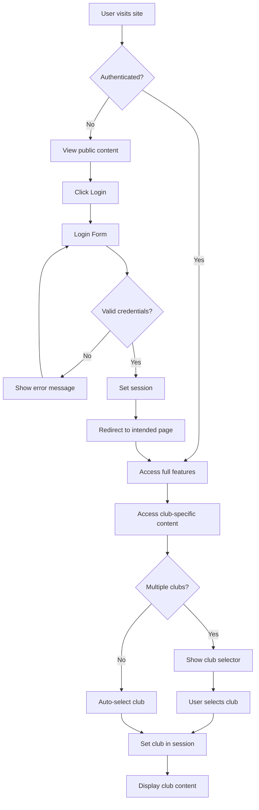
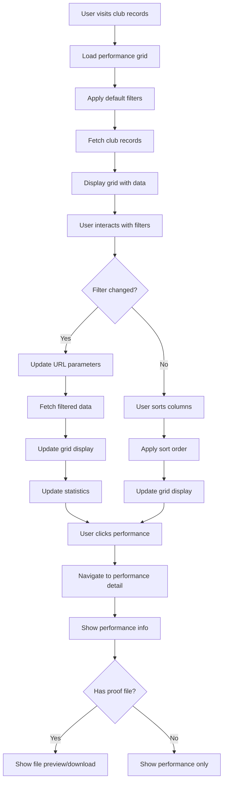
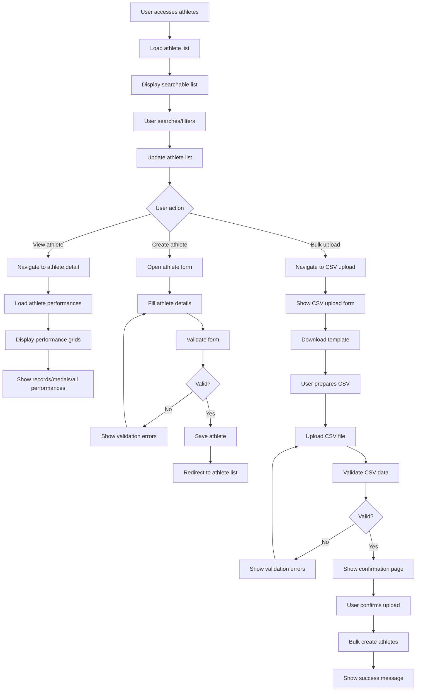
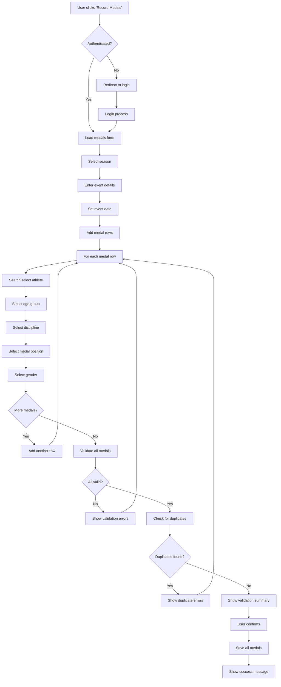
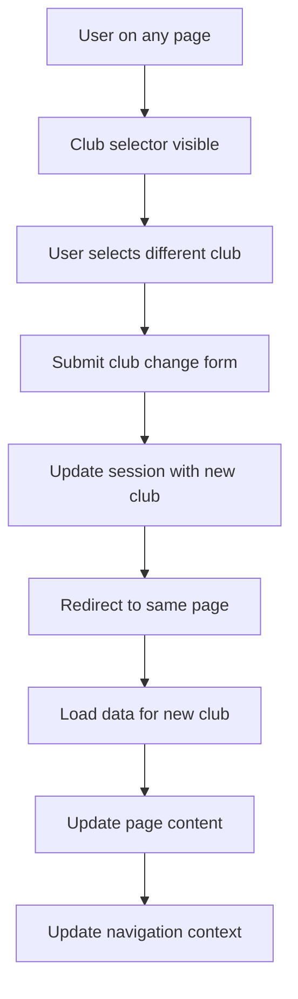
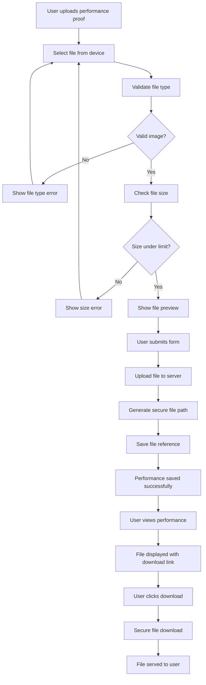
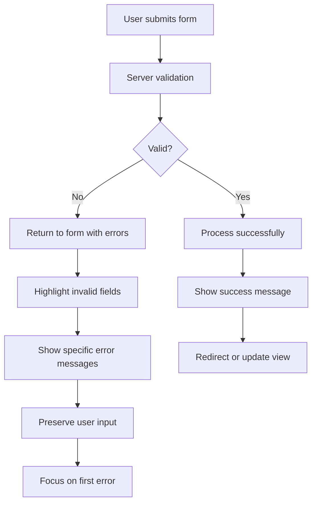
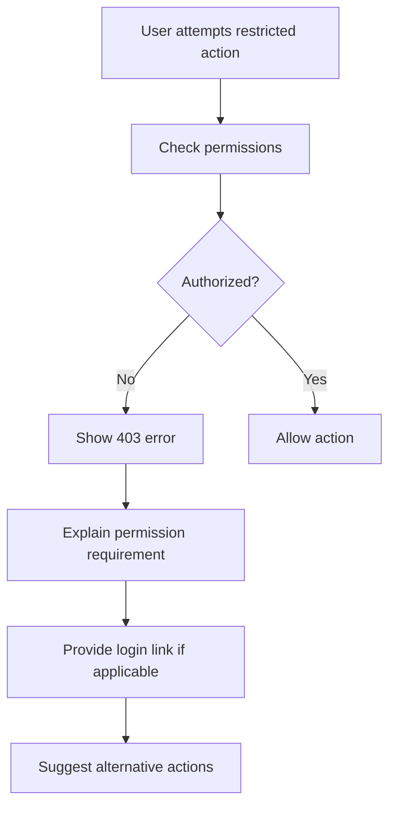
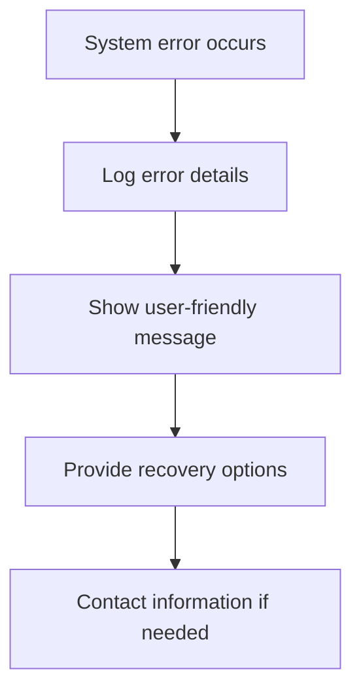

# User Flows & Interaction Patterns

## Overview

This document outlines the key user flows and interaction patterns within the TrackRecord system. The flows are organized by user type and primary use cases, showing how users navigate through the system to accomplish their goals.

## User Types & Access Levels

### 1. Anonymous Users

- **Access**: Read-only access to public club records
- **Limitations**: Cannot create, edit, or delete data
- **Primary Actions**: View records, browse athletes, explore disciplines

### 2. Authenticated Users

- **Access**: Full read access, performance creation capabilities
- **Capabilities**: Record performances, create athletes, manage competitions
- **Restrictions**: Club-specific data access

### 3. Staff Members

- **Access**: Extended administrative capabilities
- **Capabilities**: Bulk operations, CSV uploads, system configuration
- **Restrictions**: Club-level administration

### 4. Superusers

- **Access**: Complete system administration
- **Capabilities**: Django admin, user management, system-wide configuration
- **Restrictions**: None

## Core User Flows

### 1. User Authentication Flow



### 2. Performance Recording Flow

```mermaid
flowchart TD
    A[User clicks 'Record Performance'] --> B{Authenticated?}
    B -->|No| C[Redirect to login]
    B -->|Yes| D[Load performance form]

    C --> E[Login process]
    E --> D

    D --> F[Search/Select athlete]
    F --> G{Athlete exists?}
    G -->|No| H[Create new athlete form]
    G -->|Yes| I[Select athlete]

    H --> J[Fill athlete details]
    J --> K[Save athlete]
    K --> I

    I --> L[Select age group]
    L --> M[Select discipline]
    M --> N{Team discipline?}
    N -->|Yes| O[Select team members]
    N -->|No| P[Continue to performance]

    O --> Q{All team members selected?}
    Q -->|No| R[Show validation error]
    Q -->|Yes| P

    P --> S[Enter performance data]
    S --> T{Medal or performance value?}
    T -->|Neither| U[Show validation error]
    T -->|Valid| V[Upload proof (optional)]

    U --> S
    V --> W[Add event details]
    W --> X[Validate performance]
    X --> Y{Valid?}
    Y -->|No| Z[Show errors]
    Y -->|Yes| AA[Check for records]

    Z --> S
    AA --> BB[Show validation summary]
    BB --> CC[User confirms]
    CC --> DD[Save performance]
    DD --> EE[Update records automatically]
    EE --> FF[Show success message]
```

### 3. Club Records Viewing Flow



### 4. Athlete Management Flow



### 5. Medal Recording Flow



### 6. Club Switching Flow



### 7. File Upload & Management Flow



## Navigation Patterns

### Primary Navigation

1. **Home**: Dashboard with recent records and quick actions
2. **Club Records**: Filterable grid of current club records
3. **Medals**: Competition results and medal tracking
4. **Athletes**: Searchable athlete directory
5. **Disciplines**: Athletic events and categories

### Secondary Navigation (Authenticated Users)

1. **Admin Menu**: Performance recording, medal entry, bulk operations
2. **System Admin**: Django admin interface (staff only)
3. **Club Management**: Age groups, seasons, medals configuration

### Contextual Navigation

1. **Breadcrumbs**: Show current location in hierarchy
2. **Related Links**: Navigate between related entities
3. **Quick Actions**: Context-sensitive action buttons

## Error Handling Patterns

### Validation Errors



### Permission Errors



### System Errors



## Mobile & Responsive Patterns

### Mobile Navigation

- Collapsible hamburger menu
- Touch-friendly button sizes
- Swipe gestures for data grids
- Optimized form layouts

### Responsive Breakpoints

- **Mobile**: < 768px - Single column layouts
- **Tablet**: 768px - 1024px - Adapted layouts
- **Desktop**: > 1024px - Full feature layouts

### Touch Interactions

- Tap targets minimum 44px
- Swipe for horizontal scrolling
- Pull-to-refresh on data views
- Long press for context menus

## Performance Optimization Patterns

### Data Loading

- Lazy loading for large datasets
- Pagination for performance grids
- AJAX for dynamic content updates
- Caching for frequently accessed data

### User Experience

- Loading indicators for slow operations
- Progressive enhancement
- Offline capability considerations
- Keyboard navigation support

## Accessibility Patterns

### Navigation

- Skip links for keyboard users
- Logical tab order
- ARIA labels and landmarks
- Screen reader compatibility

### Forms

- Clear field labels
- Error message associations
- Required field indicators
- Validation feedback timing

### Content

- Semantic HTML structure
- Alt text for images
- Color contrast compliance
- Text scaling support

This comprehensive user flow documentation provides a clear understanding of how users interact with the TrackRecord system across all major use cases and scenarios.
