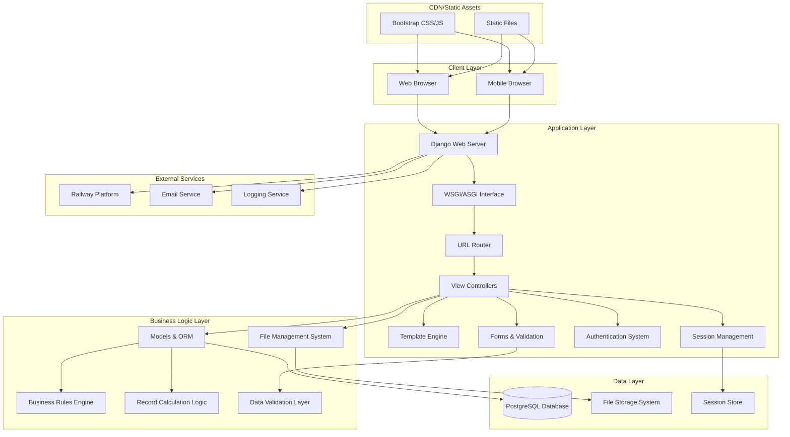
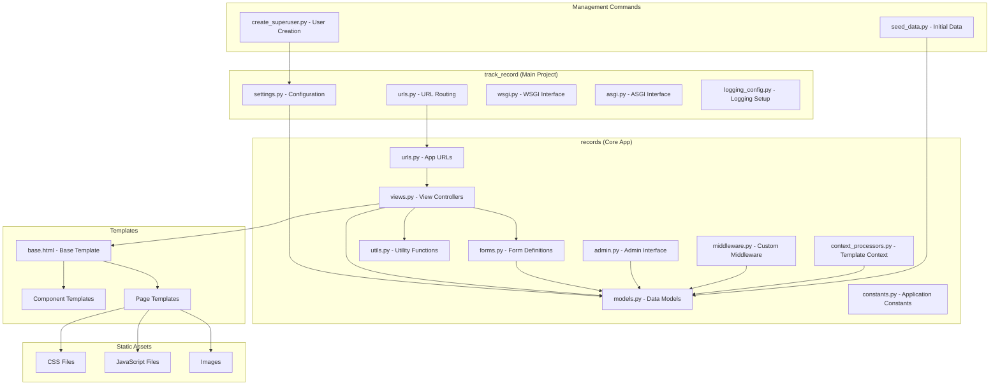
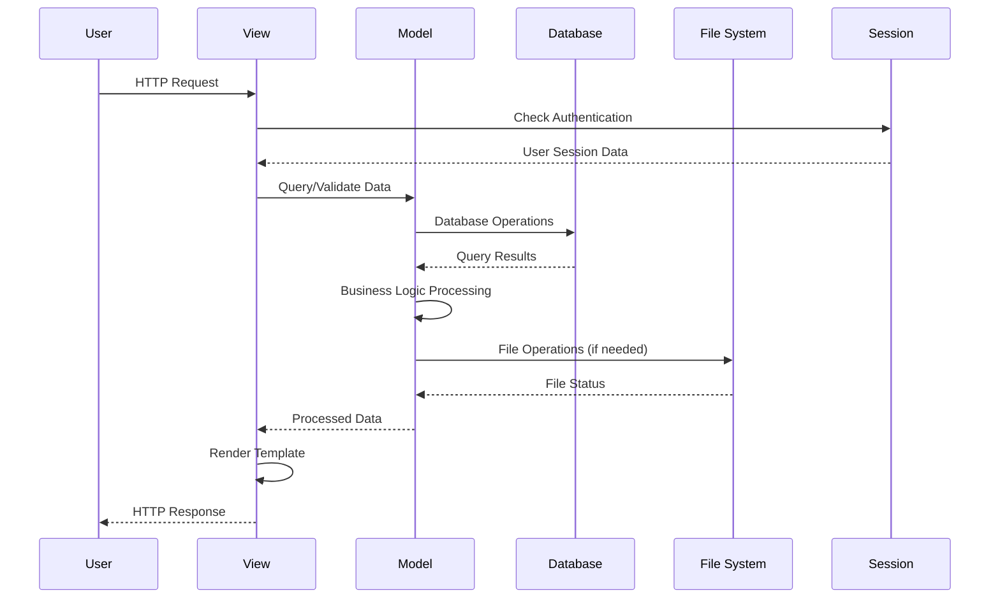
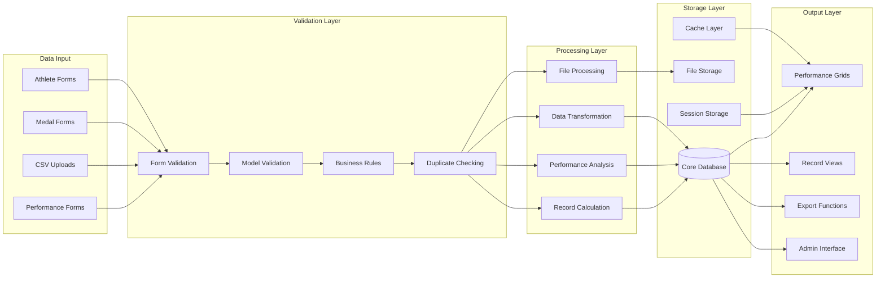
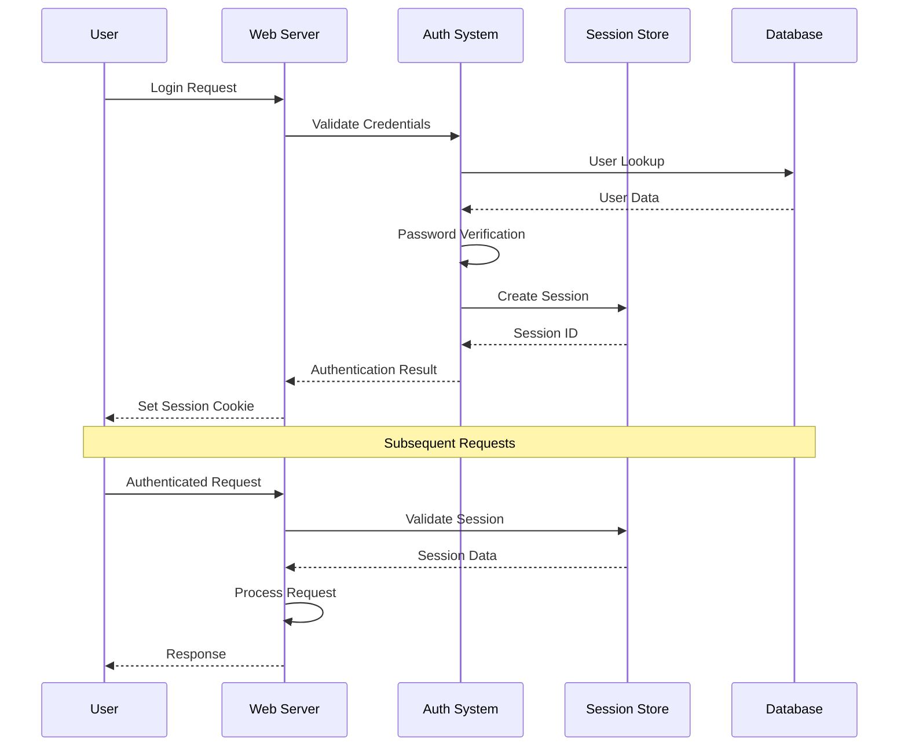
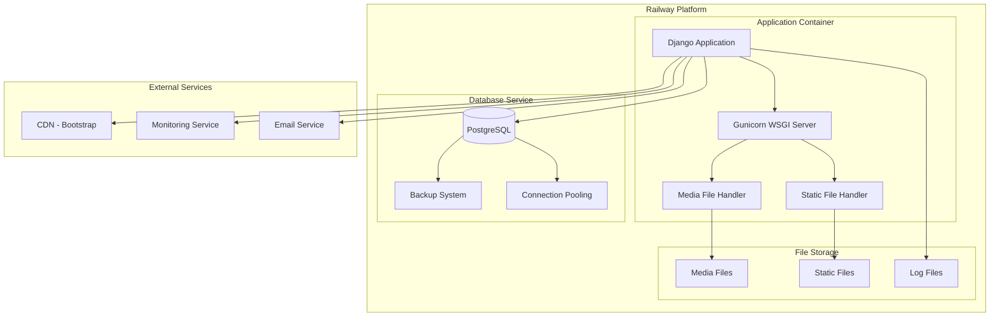
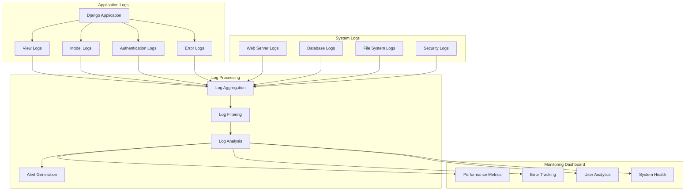

# System Architecture

## Overview

TrackRecord follows a modern web application architecture built on Django framework principles. The system is designed for scalability, maintainability, and deployment flexibility while providing robust athletics club management capabilities.

## High-Level Architecture

## Application Architecture

### Django Project Structure

## Component Architecture

### Core Components

#### 1. Web Application Layer

- **Django Framework**: Core web framework providing MVC architecture
- **URL Routing**: Centralized URL configuration with app-specific routing
- **View Controllers**: Handle HTTP requests and coordinate business logic
- **Template Engine**: Django templates with custom context processors
- **Static File Handling**: WhiteNoise for production static file serving

#### 2. Authentication & Authorization

- **Django Auth System**: Built-in user authentication
- **Session Management**: Server-side session storage
- **Permission System**: Role-based access control
- **Club Context**: Multi-club session management via middleware

#### 3. Data Management Layer

- **Django ORM**: Object-relational mapping for database operations
- **Model Validation**: Multi-layer validation (model, form, business logic)
- **Migration System**: Database schema versioning and evolution
- **Transaction Management**: ACID compliance for critical operations

#### 4. Business Logic Engine

- **Record Calculation**: Automatic club record and personal best detection
- **Performance Validation**: Complex business rule enforcement
- **Data Integrity**: Cross-entity validation and constraint enforcement
- **Audit Trail**: Comprehensive change tracking and history

#### 5. File Management System

- **Secure Upload**: File type and size validation
- **Storage Management**: Organized file storage with path generation
- **Access Control**: Secure file download with permission checking
- **Media Handling**: Image processing and optimization

### Component Interaction Flow

## Data Architecture

### Database Design Principles

- **Normalized Schema**: Eliminates data redundancy
- **Referential Integrity**: Foreign key constraints ensure data consistency
- **Performance Optimization**: Strategic indexing for common queries
- **Scalability**: Designed for horizontal and vertical scaling

### Data Flow Architecture

## Security Architecture

### Authentication Flow

### Security Layers

#### 1. Transport Security

- **HTTPS Enforcement**: SSL/TLS encryption for all communications
- **Secure Headers**: Security headers for XSS and clickjacking protection
- **CSRF Protection**: Cross-site request forgery prevention

#### 2. Authentication Security

- **Password Hashing**: Django's PBKDF2 password hashing
- **Session Security**: Secure session cookies with appropriate flags
- **Login Protection**: Rate limiting and account lockout mechanisms

#### 3. Authorization Security

- **Permission Checks**: Role-based access control at view level
- **Data Isolation**: Club-based data segregation
- **Admin Access**: Separate administrative interface with elevated permissions

#### 4. Data Security

- **Input Validation**: Multi-layer input sanitization
- **SQL Injection Prevention**: ORM-based database access
- **File Upload Security**: Type validation and secure storage

#### 5. Infrastructure Security

- **Environment Variables**: Secure configuration management
- **Secret Management**: Proper handling of API keys and secrets
- **Audit Logging**: Comprehensive security event logging

## Deployment Architecture

### Container Architecture

### Development vs Production

#### Development Environment

- **SQLite Database**: File-based database for local development
- **Debug Mode**: Enhanced error reporting and debugging tools
- **Local File Storage**: Media files stored locally
- **Development Server**: Django's built-in development server

#### Production Environment

- **PostgreSQL Database**: Robust production database with Railway hosting
- **Production Mode**: Optimized settings with error logging
- **Cloud Storage**: Scalable file storage solution
- **WSGI Server**: Gunicorn for production request handling

### Deployment Pipeline

```mermaid
graph LR
    A[Code Commit] --> B[GitHub Repository]
    B --> C[Railway Detection]
    C --> D[Build Process]
    D --> E[Container Creation]
    E --> F[Database Migration]
    F --> G[Static File Collection]
    G --> H[Health Check]
    H --> I[Live Deployment]
    I --> J[Monitoring Active]
```

## Performance Architecture

### Optimization Strategies

#### 1. Database Optimization

- **Query Optimization**: Efficient ORM queries with select_related and prefetch_related
- **Index Strategy**: Strategic indexing on frequently queried fields
- **Connection Pooling**: Efficient database connection management
- **Query Caching**: Caching for expensive database operations

#### 2. Application Optimization

- **Template Caching**: Caching of rendered templates
- **Static File Optimization**: Compression and minification
- **AJAX Loading**: Dynamic content loading for better user experience
- **Lazy Loading**: Deferred loading of non-critical content

#### 3. Frontend Optimization

- **CDN Usage**: External CDN for framework assets
- **Asset Minification**: Compressed CSS and JavaScript
- **Image Optimization**: Optimized image formats and sizes
- **Responsive Design**: Efficient layouts for all device types

### Scalability Considerations

#### Horizontal Scaling

- **Stateless Application**: Session data stored externally
- **Load Balancer Ready**: Application designed for multiple instances
- **Database Scaling**: Read replicas and connection pooling support

#### Vertical Scaling

- **Resource Optimization**: Efficient memory and CPU usage
- **Caching Strategy**: Multiple levels of caching implementation
- **Background Processing**: Asynchronous task processing capability

## Monitoring & Observability

### Logging Architecture

### Health Monitoring

- **Application Health**: Endpoint monitoring and response time tracking
- **Database Health**: Connection status and query performance monitoring
- **Resource Usage**: Memory, CPU, and storage utilization tracking
- **Error Tracking**: Comprehensive error logging and alerting

## Integration Architecture

### External Integrations

- **Bootstrap CDN**: UI framework and icon libraries
- **Railway Platform**: Hosting and database services
- **Email Services**: Notification and communication capabilities
- **Monitoring Services**: Application performance monitoring

### API Architecture

- **RESTful Endpoints**: JSON-based API for dynamic functionality
- **CSRF Protection**: Secure API access with token validation
- **Authentication Required**: API endpoints require user authentication
- **Rate Limiting**: Protection against API abuse

### Future Integration Points

- **Third-party Analytics**: Advanced reporting and analytics integration
- **External Timing Systems**: Integration with competition timing equipment
- **Mobile Applications**: API support for native mobile apps
- **Social Media**: Integration with social platforms for sharing achievements

This architecture provides a solid foundation for the TrackRecord system while maintaining flexibility for future enhancements and scaling requirements.
