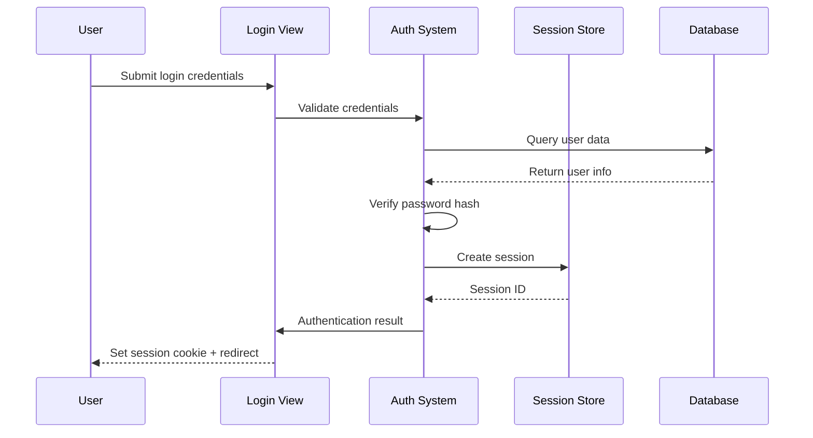
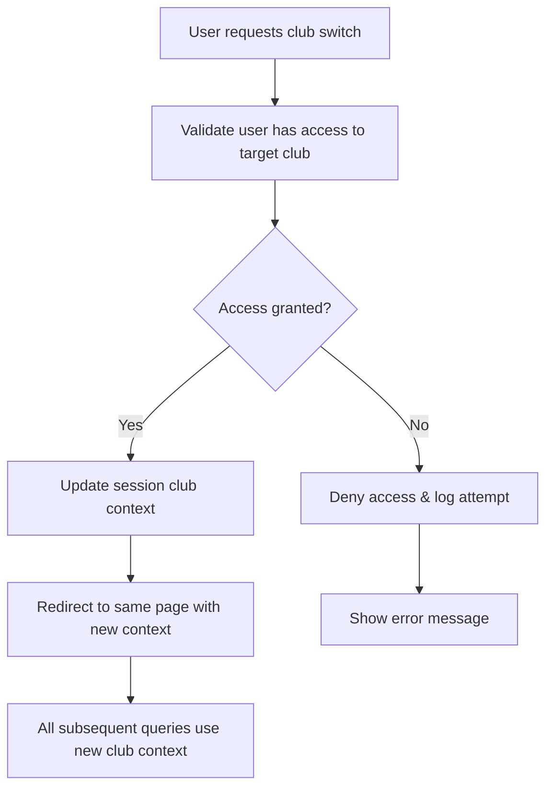

# Security Model & User Permissions

## Overview

The TrackRecord system implements a comprehensive security model designed to protect sensitive athletics data while providing appropriate access levels for different user types. The security architecture follows Django best practices with additional custom implementations for multi-club data isolation.

## Authentication System

### User Authentication Framework

#### Django Authentication Integration

- **Framework**: Built on Django's robust authentication system
- **Session Management**: Server-side session storage with secure cookies
- **Password Security**: PBKDF2 password hashing with salt
- **Login Protection**: Custom login view with enhanced security features

#### Authentication Flow



### Session Management

#### Session Security

- **Secure Cookies**: Session cookies marked as secure and HTTP-only
- **Session Timeout**: Configurable session timeout for security
- **CSRF Protection**: Cross-site request forgery protection on all forms
- **Session Invalidation**: Proper session cleanup on logout

#### Club Context Management

- **Multi-Club Sessions**: Sessions maintain current club context
- **Club Switching**: Secure club switching with validation
- **Context Isolation**: All queries filtered by session club context
- **Permission Inheritance**: Club-specific permissions applied automatically

## Authorization & Access Control

### User Role Hierarchy

#### 1. Anonymous Users

- **Access Level**: Read-only public data
- **Permissions**:
  - View club records (filtered by club context)
  - Browse athlete profiles (public information only)
  - View discipline and season information
  - Access public statistics and summaries
- **Restrictions**:
  - Cannot create, edit, or delete any data
  - Cannot access file uploads or downloads
  - Cannot view sensitive athlete information

#### 2. Authenticated Users

- **Access Level**: Full club-specific data access
- **Permissions**:
  - Create and manage performances
  - Create and manage athletes within their club
  - Upload and download performance proof files
  - Access detailed athlete performance data
  - Use all interactive features and forms
- **Restrictions**:
  - Limited to their assigned club's data
  - Cannot access administrative functions
  - Cannot perform bulk operations

#### 3. Staff Users

- **Access Level**: Administrative capabilities within club context
- **Permissions**:
  - All authenticated user permissions
  - Bulk athlete uploads via CSV
  - Administrative data management
  - Access to advanced reporting features
  - System configuration within club scope
- **Restrictions**:
  - Still limited to club-specific data
  - Cannot access Django admin interface
  - Cannot modify system-wide settings

#### 4. Superusers

- **Access Level**: Complete system administration
- **Permissions**:
  - Full access to Django admin interface
  - Cross-club data access and management
  - System-wide configuration and settings
  - User management and role assignment
  - Complete database access and modification
- **Restrictions**:
  - None - complete system access

### Permission Implementation

#### View-Level Security

```python
# Example permission checking pattern
@login_required
def create_performance(request):
    # Club context automatically applied
    # User permissions validated
    # Data access restricted to user's club
```

#### Model-Level Security

- **Automatic Filtering**: All queries automatically filtered by club context
- **Permission Decorators**: Views protected with appropriate decorators
- **Custom Middleware**: Club context middleware ensures data isolation
- **Access Validation**: Every data access validated against user permissions

## Data Access Control

### Club Data Isolation

#### Multi-Club Architecture

- **Complete Isolation**: Each club's data completely isolated from others
- **Context Enforcement**: Club context enforced at middleware level
- **Query Filtering**: All database queries automatically filtered by club
- **Session Binding**: Club context bound to user session

#### Club Switching Security



### File Access Security

#### Performance Proof Files

- **Secure Storage**: Files stored outside web root with secure paths
- **Access Validation**: File access validated against user permissions
- **Club Context**: File access restricted to appropriate club members
- **Download Security**: Secure download mechanism with permission checks

#### File Upload Security

- **Type Validation**: Only allowed file types accepted
- **Size Limits**: File size restrictions prevent abuse
- **Malware Scanning**: Basic security scanning for uploaded files
- **Secure Naming**: Files renamed with secure, unique identifiers

## Security Measures

### Input Validation & Sanitization

#### Form Security

- **CSRF Protection**: All forms protected against CSRF attacks
- **Input Sanitization**: All user input sanitized and validated
- **SQL Injection Prevention**: Django ORM prevents SQL injection
- **XSS Protection**: Template system prevents cross-site scripting

#### File Upload Security

- **File Type Validation**: Strict file type checking
- **Content Validation**: File content validation beyond extension
- **Size Restrictions**: Maximum file size limits
- **Secure Storage**: Files stored in secure locations

### Transport Security

#### HTTPS Enforcement

- **SSL/TLS**: All communications encrypted with HTTPS
- **Secure Headers**: Security headers prevent clickjacking and XSS
- **HSTS**: HTTP Strict Transport Security enforced
- **Certificate Validation**: Proper SSL certificate validation

#### Cookie Security

- **Secure Flags**: Session cookies marked as secure
- **HTTP-Only**: Cookies not accessible via JavaScript
- **SameSite**: SameSite attribute prevents CSRF attacks
- **Expiration**: Appropriate cookie expiration times

### Data Protection

#### Sensitive Data Handling

- **Password Storage**: Passwords hashed with strong algorithms
- **Personal Information**: Athlete data protected with access controls
- **Performance Data**: Competition results secured appropriately
- **File Storage**: Uploaded files stored securely

#### Privacy Controls

- **Data Minimization**: Only necessary data collected and stored
- **Access Logging**: All data access logged for audit purposes
- **Retention Policies**: Data retention policies implemented
- **User Consent**: Appropriate consent mechanisms for data collection

## Audit & Monitoring

### Security Logging

#### Authentication Events

- **Login Attempts**: All login attempts logged with IP addresses
- **Failed Logins**: Failed login attempts tracked for security monitoring
- **Session Events**: Session creation, modification, and destruction logged
- **Permission Violations**: Unauthorized access attempts logged

#### Data Access Logging

- **Performance Records**: Creation, modification, and deletion logged
- **File Access**: File uploads and downloads logged
- **Administrative Actions**: All administrative actions logged
- **Cross-Club Access**: Any cross-club data access logged

### Security Monitoring

#### Threat Detection

- **Brute Force Protection**: Login attempt rate limiting
- **Suspicious Activity**: Unusual access patterns detected
- **File Upload Monitoring**: Malicious file upload attempts tracked
- **Permission Violations**: Unauthorized access attempts monitored

#### Incident Response

- **Alert System**: Security alerts for suspicious activity
- **Log Analysis**: Regular log analysis for security threats
- **Response Procedures**: Defined procedures for security incidents
- **Recovery Plans**: Data recovery and system restoration plans

## Compliance & Standards

### Security Standards

#### Industry Best Practices

- **OWASP Guidelines**: Following OWASP security guidelines
- **Django Security**: Implementing Django security best practices
- **Data Protection**: Compliance with data protection regulations
- **Security Testing**: Regular security testing and vulnerability assessment

#### Code Security

- **Secure Coding**: Following secure coding practices
- **Dependency Management**: Regular security updates for dependencies
- **Code Review**: Security-focused code review processes
- **Vulnerability Scanning**: Regular vulnerability scanning

### Data Governance

#### Access Control Policies

- **Role-Based Access**: Clear role-based access control policies
- **Principle of Least Privilege**: Users granted minimum necessary permissions
- **Regular Reviews**: Periodic review of user permissions and access
- **Segregation of Duties**: Appropriate separation of responsibilities

#### Data Handling Policies

- **Data Classification**: Appropriate classification of sensitive data
- **Handling Procedures**: Clear procedures for handling different data types
- **Retention Policies**: Defined data retention and deletion policies
- **Breach Response**: Procedures for handling data breaches

This comprehensive security model ensures that the TrackRecord system maintains the highest standards of data protection while providing appropriate access levels for different user types and use cases.
